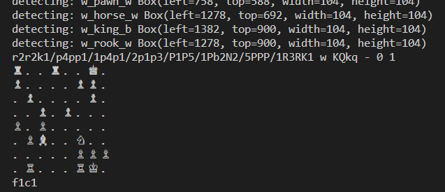

<h1>Шахматный бот <u>V.1.0.1</u> </h1>

Шахматный бот - это программа на Python для игры в шахматы с использованием машинного зрения. Он может определить шахматную доску на экране, собрать изображения шахматных фигур для последующего определения на доске и играть с пользователем или другим ботом. Этот проект использует библиотеки cv2, numpy, pyautogui и chess.

<h2>Установка необходимых зависимостей:</h2>

<code>python3 -m pip install opencv-python numpy pyautogui chess</code>

<h2>Для запуска бота выполните команду:</h2>

<code>python3 chessbot.py white</code>
где white - это цвет стороны, которую будет играть бот.

 

<h2>Вывод в консоль:</h2>

<h2>Подключенные шахматные движки</h2>
- Stockfish
- BBC
- Xiphos
Есть возможность подключить другой шахматный движок.

 
<h2>Структура проекта:</h2>
<ul>
  <b><li>/images/</li></b>
  <ul>
    <b><li>/figures/</li></b>
    <b><li>/public/</li></b>
    <li>screenshot_1.png</li>
  <ul>
  <li>/chessbot.py</li>
  <li>/find_boadr.py</li>
  <li>/find_figures.py</li>
  <li>/find_kin_queen.py</li>
  <li>/LICENSE</li>
  <li>/readme.md</li>
</ul>

<h2>Авторы</h2>
WebNet (@webnetkz)
<h2>Лицензия</h2>
Этот проект находится под лицензией GPL-3. Подробности смотрите в файле <a href="LICENSE">LICENSE</a>.

